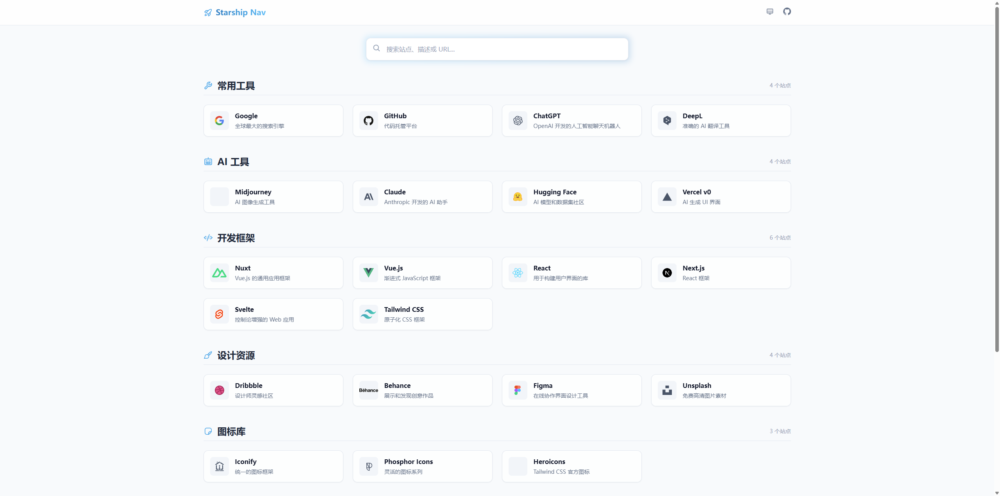

# 星舰导航

🚀星舰导航，一个基于 Nuxt 4 构建的现代化、高颜值导航站。



## ✨ 特性

- **最新技术栈**：采用 Nuxt 4 + Vue 3 + TypeScript 开发。
- **极致美学**：使用 Tailwind CSS 打造的现代化毛玻璃（Glassmorphism）风格界面。
- **轻量级**：无外部数据库依赖，使用 TypeScript 文件管理数据，类型安全且易于维护。
- **功能丰富**：
  - 🔍 实时搜索：支持标题、描述和 URL 搜索。
  - 📱 响应式设计：完美适配移动端和桌面端。
  - 🎨 图标支持：集成 Nuxt Icon，支持数万种图标。
  - ⚡️ SEO 友好：预配置 Meta 标签和语义化 HTML。
  - 🌓 深色模式：支持浅色、深色及跟随系统自动切换。
  - ⬆️ 回到顶部：智能显示的平滑滚动回到顶部按钮。

## 🏗 架构设计

项目采用 Nuxt 4 的目录结构：

- `app/data/sites.ts`: **数据中心**。所有站点数据在此维护，无需后端服务。
- `app/components/`: **组件库**。包含 `SiteCard`、`TheHeader` 等复用组件。
- `app/pages/`: **页面逻辑**。首页包含搜索过滤和分类展示逻辑。
- `app/assets/css/`: **样式系统**。基于 Tailwind CSS 的定制化配置。

## 🚀 快速开始

本项目推荐使用 `pnpm` 进行包管理。

### 安装依赖

```bash
pnpm install
```

### 开发环境

启动本地开发服务器：

```bash
pnpm dev
```

访问 http://localhost:3000 即可预览。

### 构建部署

构建生产环境代码：

```bash
pnpm build
```

预览构建产物：

```bash
pnpm preview
```

## ☁️ 部署到托管平台

### 部署到 Vercel

[](https://vercel.com/new/clone?repository-url=https://github.com/CharlesLee1120/Nuxt-Starship-Nav)

### 部署到 Cloudflare Pages

[](https://dash.cloudflare.com/?to=/:account/workers-and-pages/create/deploy-to-workers&repository=https://github.com/CharlesLee1120/Nuxt-Starship-Nav)


## 📝 数据管理

要添加或修改站点，只需编辑 `app/data/sites.ts` 文件：

```typescript
export const categories: Category[] = [
  {
    title: '分类名称',
    icon: 'ph:icon-name',
    sites: [
      {
        title: '站点名称',
        url: 'https://example.com',
        desc: '站点描述',
        icon: 'logos:icon-name'
      }
    ]
  }
]
```

## ️ ❤️ 致谢
- [Nuxt 4](https://nuxt.com/docs/4.x/getting-started/installation)
- [Google Antigravity](https://antigravity.google/)
- [Google Gemini 3 Pro](https://gemini.google.com/app)

## 📄 License

本项目采用 MIT License 开源协议，任何人都可以自由使用、修改和分发本项目。

详见 [MIT License](https://opensource.org/licenses/MIT)。
